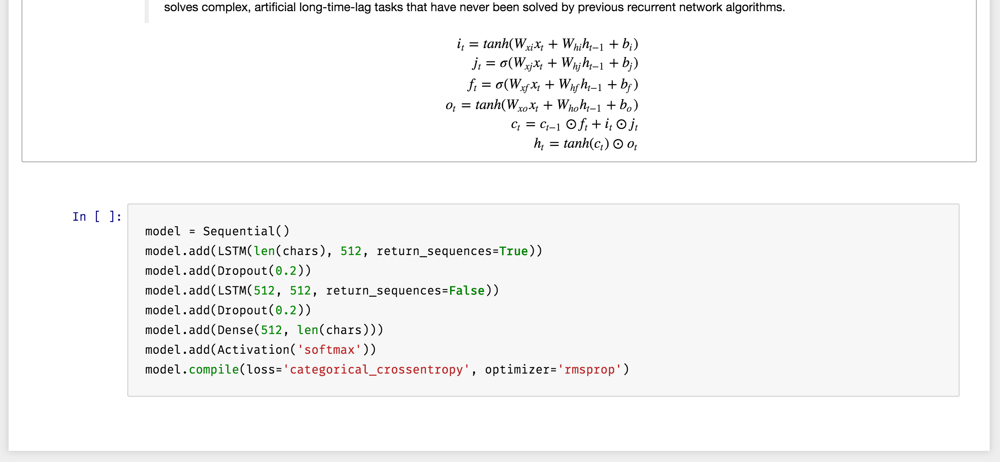
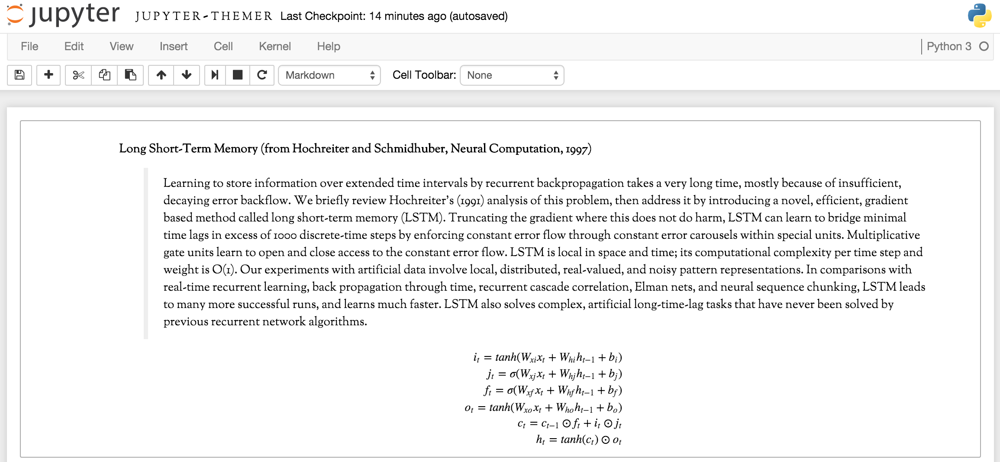
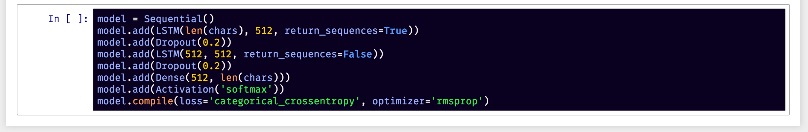
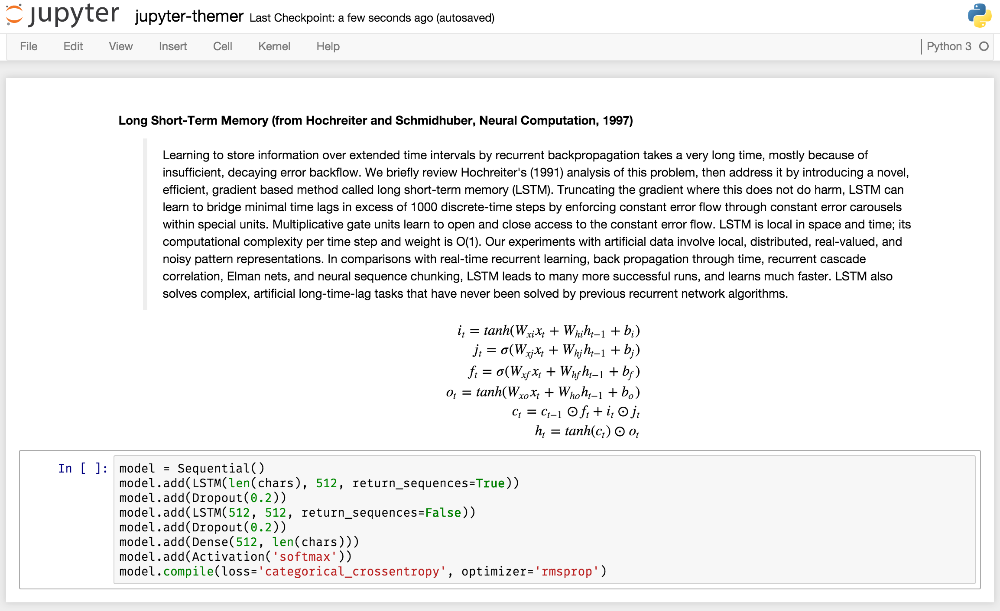

# jupyter-themer

 

Apply custom CSS styling to your jupyter notebooks. Contributions are welcome!

Mix and match themes by:

- layout (example: `wide`)



- typography (example: `serif`)



- color (example: `night`)



You can always revert back to the default:



### Installation

```sh
pip install jupyter-themer
```

or

```sh
python setup.py install
```

### Usage

NOTE: Old ipython configuration files, for example at the default `~/.ipython`, may need to be removed in order for jupyter to use the correct files.

```sh
usage: jupyter-themer [-c COLOR, --color COLOR]
                      [-l LAYOUT, --layout LAYOUT]
                      [-t TYPOGRAPHY, --typography TYPOGRAPHY]
                      [-f CODE_FONT, --font CODE_FONT]
                      [-b BACKGROUND, --background BACKGROUND]
                      [-s OPTION, --show OPTION]
                      [-p PATH, --css_path PATH]
```

If no arguments are supplied, the program will revert the jupyter notebook style back to default.

Any combination of the style types can be specified, and the program will mix together the associated color/layout/typographic/code font/background css files accordingly, writing it to the `custom.css` file used by the notebook. Use `-p` or `--css_path` to specify a custom path for the css file, for example if you need per-user configuration.

To get a list of available options use the `show` argument, e.g. `jupyter-themer --show color`

For all running notebooks, a quick browser refresh will be needed to apply the stylesheet.

### Available themes

##### `-c, --color`

- `3024-day`
- `3024-night`
- `abcdef`
- `ambiance`
- `base16-dark`
- `base16-light`
- `blackboard`
- `cobalt`
- `colorforth`
- `dracula`
- `eclipse`
- `elegant`
- `erlang-dark`
- `icecoder`
- `lesser-dark`
- `liquibyte`
- `material`
- `mbo`
- `mdn-like`
- `midnight`
- `monokai`
- `neat`
- `neo`
- `night`
- `paraiso-dark`
- `paraiso-light`
- `pastel-on-dark`
- `rubyblue`
- `seti`
- `solarized-light`
- `solarized-dark`
- `the-matrix`
- `tomorrow-night-bright`
- `tomorrow-night-eighties`
- `ttcn`
- `twilight`
- `vibrant-ink`
- `xq-dark`
- `xq-light`
- `yeti`
- `zenburn`

##### `-l, --layout`

- `wide`
- `hovertable`

##### `-t, --typography`

- `serif`

##### `-f, --font`

- `Ubuntu_Mono`

##### `-b, --background`

- `dark`

### License

MIT License
